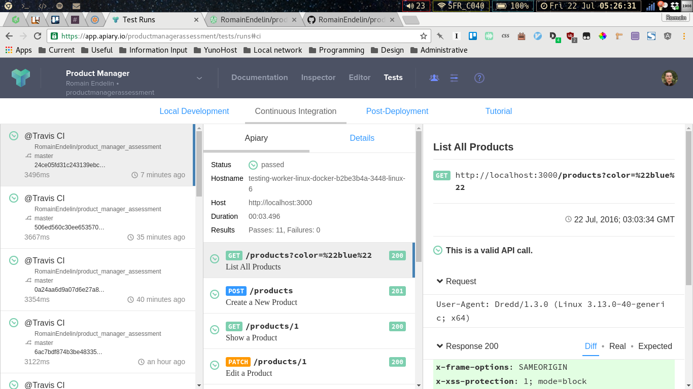

# Assessment - Product Manager

 | [The Product Manager Application](https://product-manager-assessment.herokuapp.com) | [Roadmap](https://www.pivotaltracker.com/n/projects/1662965) | [API Documentation & Test](http://docs.productmanagerassessment.apiary.io/)

This project is a technical assessment for SaleStock's recruitment process. I have chosen to implement a REST API for a product manager.

It includes the following features:

* CRUD operations on products and categories;
* Hierarchical tree data of categories;
* Filtering products by color, size or price range.

## API Documentation

The API is documented with [Apiary.io](http://docs.productmanagerassessment.apiary.io/).
An up-to-date validation is generated in the "Test" section (available for registered members of the project).

## Usage

`Product Manager` has been deployed on `Heroku`, access it [here](https://product-manager-assessment.herokuapp.com).

You can interact with `Product manager` using `curl`, a [Chrome plugin](https://chrome.google.com/webstore/detail/advanced-rest-client/hgmloofddffdnphfgcellkdfbfbjeloo), a [Firefox plugin](https://addons.mozilla.org/en-US/firefox/addon/restclient/), or an [IE plugin](https://goo.gl/FkCd13).

You may also interact with the production server directly from [Apiary.io](http://docs.productmanagerassessment.apiary.io/):

* Select an action (e.g., "List all products")
* Click "Switch to console"
* Replace "Mock Server" by "Production"
* Click "Call resource"

## Installation

* **Prerequisite:**
    * Ruby v2.3.1 (I recommend using Rbenv)
    * Bundler (`$ gem install bundler`)
* **Clone:**
    * `$ git clone https://github.com/RomainEndelin/product_manager_assessment.git product_manager`
    * `$ cd product_manager`
* **Install:**
    * `bundle install`
    * `bin/rails db:setup`
* **Test the code:**
    * `bin/rails db:schema:load`
    * `bin/rails db:test:prepare`
    * `bin/rspec` OR `bin/guard`
* **Test the API:**
    * `bin/rails db:reset` *(the API testing depends on the initial seed data)*
    * `dredd --sorted`
* **Run:**
    * `$ rails s`

## Implementation Details

This assessment has been developed with Ruby on Rails 5, in API mode. It has been developed through Test-Driven-Development.
As such, it is fully test-covered.
The project follows a very straightforward Rails architecture, and functional tests are located in `spec/requests/api`.
The API documentation is located in `apiary.apib`.

The design of the API has been domain-driven, thanks to the use of [Apiary.io](http://docs.productmanagerassessment.apiary.io/) (based on [API Blueprint](https://apiblueprint.org/)) and [Pivotal Tracker](https://www.pivotaltracker.com/n/projects/1662965).
The focus has been put on quality and reliability rather than scope. So the API is rather basic, but thanks to the test coverage and the CI infrastructure, it could be easily extended or refactored.

The project includes a Continuous Integration and Continuous Deployment infrastructure, based on [Github](https://github.com/RomainEndelin/product_manager_assessment), [TravisCI](https://travis-ci.org/RomainEndelin/product_manager_assessment) and [Heroku](https://product-manager-assessment.herokuapp.com).
As part of the Continuous Integration process, the API is continuously tested against its specification (using [*Dredd*](https://github.com/apiaryio/dredd)), and the results are reported into *Apiary.io* (for registered user, as shown in the image below). This guarantees the documentation to be always up-to-date.

## Perspectives

* Performance:
    * Caching
    * Expand relations on-demand (e.g., replace `category_ids: [1]` by `categories: [{'id': '1', 'name': ... }]`)
    * Pagination
* Security:
    * Rate Limiting
* User Experience:
    * Use a subdomain for the API (e.g., `api.product-manager-assessment.herokuapp.com`)
    * Versioning the API
    * HATEOAS / JSON-API

## Contributing

For an overview of the project development cycle, have a look at its [Pivotal Tracker](https://www.pivotaltracker.com/n/projects/1662965).

This project is a two-days project and will most likely be discontinued later on.
In case you wish to contribute on it anyway, please [contact me](mailto:romain@endelin.fr) first. *More specifically, if you are yourself applying to SaleStock and you want to get inspired by my code, you should discuss it with SaleStock's recruiter first.*

THE SOFTWARE IS PROVIDED "AS IS", WITHOUT WARRANTY OF ANY KIND, EXPRESS OR
IMPLIED, INCLUDING BUT NOT LIMITED TO THE WARRANTIES OF MERCHANTABILITY,
FITNESS FOR A PARTICULAR PURPOSE AND NONINFRINGEMENT. IN NO EVENT SHALL THE
AUTHORS OR COPYRIGHT HOLDERS BE LIABLE FOR ANY CLAIM, DAMAGES OR OTHER
LIABILITY, WHETHER IN AN ACTION OF CONTRACT, TORT OR OTHERWISE, ARISING FROM,
OUT OF OR IN CONNECTION WITH THE SOFTWARE OR THE USE OR OTHER DEALINGS IN THE
SOFTWARE.
